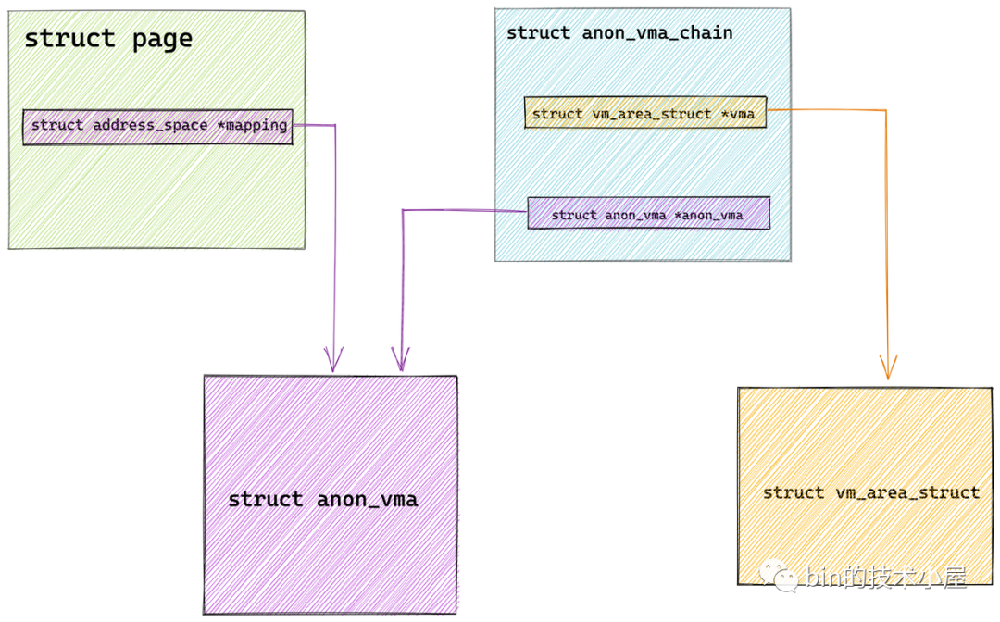
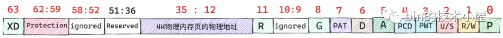
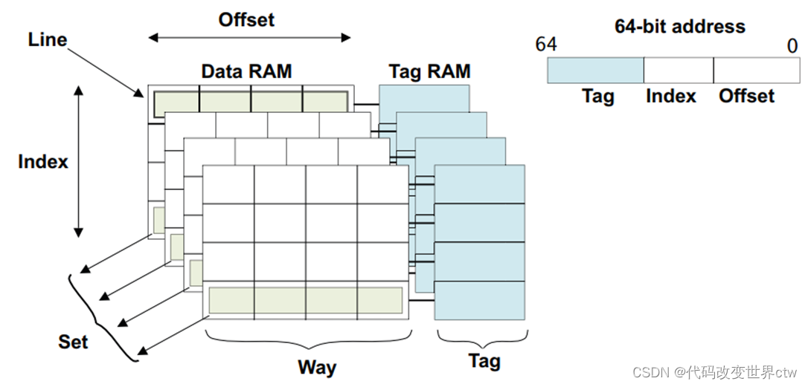

//TODO - kernel mm 分配策略 水位 watermark

//TODO - kernel NUMA node 内存 管理 zone

//TODO - kernel mm free_area free_list MIGRATE_TYPES

//TODO - kernel mm_struct mm_rb vma 各种段

//TODO - kernel 进程 fdtable

//TODO - kernel handle pte fault PTE异常处理

//TODO - kernel cr3 pgd 多级页表

//TODO - kernel watermark kswapd direct_reclaim

//TODO - kernel kmalloc 慢速路径 快速路径

//TODO - kernel v4l2 core

//TODO - kernel v4l2 enqueue dequeue

//TODO - kernel v4l2 vb2 buffer

//TODO - kernel anon_vma VS page VS vma

//TODO - kernel mm page anon_vma_chain

//TODO - kernel mm slub obj

//TODO - kernel 64bit PTE value

//TODO - kernel cache way set line index tag entry

